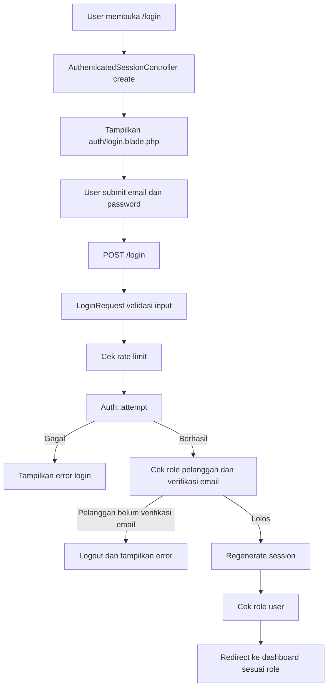

# Penjelasan Fitur Login

Dokumen ini menjelaskan alur kerja fitur login pada project Laravel e-commerce ini dengan bahasa sederhana, tetapi tetap memakai istilah teknis yang relevan.

## Gambaran Umum

Fitur login dipakai untuk memasukkan user ke sistem menggunakan email dan password. Setelah berhasil login, sistem tidak mengarahkan semua user ke halaman yang sama. User akan diarahkan ke dashboard sesuai role masing-masing, misalnya admin ke dashboard admin, pelanggan ke dashboard pelanggan, marketing ke dashboard marketing, dan seterusnya.

Secara teknis, fitur ini memakai authentication bawaan Laravel berbasis session melalui guard `web`, model `User`, dan role dari package Spatie Permission.

File utama yang terlibat:

- `routes/web.php`
- `routes/auth.php`
- `app/Http/Controllers/Auth/AuthenticatedSessionController.php`
- `app/Http/Requests/Auth/LoginRequest.php`
- `resources/views/auth/login.blade.php`
- `app/Models/User.php`
- `config/auth.php`
- `bootstrap/app.php`
- `database/seeders/RoleSeeder.php`
- `database/seeders/UserSeeder.php`

## Alur Login Dari Awal Sampai Selesai

### 1. User membuka halaman login

Ketika user membuka URL:

```text
/login
```

request akan masuk ke route login. Di project ini route login didefinisikan di dua tempat:

- `routes/web.php`
- `routes/auth.php`

Keduanya mengarah ke method yang sama:

```php
AuthenticatedSessionController::create
```

Method `create()` pada controller hanya bertugas menampilkan view login:

```php
return view('auth.login');
```

Jadi, saat user membuka `/login`, Laravel akan merender file:

```text
resources/views/auth/login.blade.php
```

### 2. Form login ditampilkan

File `resources/views/auth/login.blade.php` berisi form login. Form ini memiliki input utama:

- `email`
- `password`
- `remember`

Form dikirim memakai method `POST` ke route bernama `login`:

```blade
<form method="POST" action="{{ route('login') }}">
```

Di dalam form juga ada directive:

```blade
@csrf
```

CSRF token ini penting untuk keamanan. Laravel memakai token tersebut untuk memastikan request benar-benar berasal dari form aplikasi, bukan dari request palsu pihak luar.

### 3. User mengirim email dan password

Saat tombol login ditekan, browser mengirim request:

```text
POST /login
```

Route `POST /login` berada di `routes/auth.php` dan mengarah ke:

```php
AuthenticatedSessionController::store
```

Method `store()` menerima object:

```php
LoginRequest $request
```

Artinya sebelum proses login benar-benar dilanjutkan, data request akan melewati class khusus:

```text
app/Http/Requests/Auth/LoginRequest.php
```

### 4. LoginRequest melakukan validasi input

Di `LoginRequest`, method `rules()` memastikan data yang dikirim valid:

```php
return [
    'email' => ['required', 'string', 'email'],
    'password' => ['required', 'string'],
];
```

Artinya:

- email wajib diisi
- email harus berbentuk format email
- password wajib diisi
- password harus berupa string

Jika validasi gagal, user tidak akan diproses login. Laravel akan mengembalikan user ke halaman login dengan pesan error.

### 5. Sistem mengecek batas percobaan login

Sebelum mencocokkan email dan password, method `authenticate()` menjalankan:

```php
$this->ensureIsNotRateLimited();
```

Bagian ini memakai `RateLimiter` Laravel untuk membatasi percobaan login. Maksimal percobaan gagal adalah 5 kali untuk kombinasi email dan alamat IP yang sama.

Kunci rate limit dibuat dari:

```php
email + ip address
```

Jika sudah terlalu banyak gagal login, sistem akan menolak request sementara dan menampilkan pesan throttle. Ini berguna untuk mengurangi risiko brute force login.

### 6. Sistem mencocokkan email dan password

Setelah lolos rate limit, sistem mencoba login dengan:

```php
Auth::attempt($this->only('email', 'password'), $this->boolean('remember'))
```

Laravel akan mencari user berdasarkan email melalui provider `users` di `config/auth.php`. Provider ini menggunakan model:

```php
App\Models\User
```

Guard yang dipakai adalah:

```php
web
```

Guard `web` memakai session. Jadi setelah user berhasil login, status login disimpan di session browser.

Password tidak dibandingkan sebagai teks biasa. Di model `User`, field `password` memiliki cast:

```php
'password' => 'hashed'
```

Laravel akan membandingkan password input dengan hash password yang tersimpan di database.

Jika email atau password salah:

- percobaan gagal dicatat oleh `RateLimiter`
- user dianggap masih guest
- Laravel menampilkan pesan error dari `auth.failed`

### 7. Khusus pelanggan, email harus sudah diverifikasi

Setelah `Auth::attempt()` berhasil, ada pengecekan tambahan:

```php
if ($user?->hasRole('pelanggan') && ! $user->hasVerifiedEmail()) {
    Auth::guard()->logout();

    throw ValidationException::withMessages([
        'email' => 'Alamat email Anda belum diverifikasi. Silakan cek kotak masuk untuk tautan verifikasi.',
    ]);
}
```

Maksudnya:

- jika user memiliki role `pelanggan`
- dan email user belum diverifikasi
- maka sistem langsung logout lagi
- login dibatalkan
- user mendapat pesan bahwa email belum diverifikasi

Pengecekan ini hanya berlaku untuk pelanggan. Role lain seperti admin, marketing, gm, dan direktur tidak terkena aturan ini pada proses login.

Secara teknis, model `User` mengimplementasikan:

```php
MustVerifyEmail
```

dan kolom `email_verified_at` dicast sebagai `datetime`. Laravel memakai kolom tersebut untuk menentukan apakah email user sudah terverifikasi.

### 8. Session diperbarui setelah login berhasil

Jika autentikasi berhasil dan user lolos pengecekan email, controller menjalankan:

```php
$request->session()->regenerate();
```

Ini adalah langkah keamanan penting. Session ID dibuat ulang setelah login agar mengurangi risiko session fixation, yaitu kondisi ketika session lama disalahgunakan untuk mengambil alih login user.

### 9. Sistem membaca role user

Setelah session diperbarui, controller mengambil user yang sedang login:

```php
$user = auth()->user();
```

Lalu sistem mengecek role user dengan method:

```php
$user->hasRole('nama_role')
```

Method `hasRole()` berasal dari trait Spatie Permission yang dipakai di model `User`:

```php
use HasRoles;
```

Role yang disiapkan oleh `RoleSeeder` adalah:

- `admin`
- `pelanggan`
- `marketing`
- `gm`
- `direktur`

Contoh user awal dibuat di `UserSeeder`, lalu role diberikan menggunakan:

```php
$user->assignRole('admin');
```

### 10. User diarahkan ke dashboard sesuai role

Di `AuthenticatedSessionController::store`, redirect ditentukan seperti ini:

```php
if ($user->hasRole('admin')) {
    return redirect()->route('admin.dashboard');
} else if ($user->hasRole('pelanggan')) {
    return redirect()->route('pelanggan.dashboard');
} else if ($user->hasRole('marketing')) {
    return redirect()->route('marketing.dashboard');
} else if ($user->hasRole('gm')) {
    return redirect()->route('gm.dashboard');
} else if ($user->hasRole('direktur')) {
    return redirect()->route('direktur.dashboard');
}
```

Hasil redirect:

| Role | Tujuan setelah login |
| --- | --- |
| `admin` | `admin.dashboard` |
| `pelanggan` | `pelanggan.dashboard` |
| `marketing` | `marketing.dashboard` |
| `gm` | `gm.dashboard` |
| `direktur` | `direktur.dashboard` |
| tidak punya role di atas | `dashboard` |

Dengan kata lain, login tidak hanya memeriksa benar atau salah password. Login juga menentukan area kerja user berdasarkan role.

## Alur Perlindungan Halaman Setelah Login

Setelah user berhasil login, akses ke halaman tertentu tetap dilindungi oleh middleware.

Contoh route admin:

```php
Route::middleware(['auth', 'role:admin'])
    ->prefix('admin')
    ->name('admin.')
    ->group(function () {
        Route::get('/dashboard', [Admin\DashboardController::class, 'index'])->name('dashboard');
    });
```

Artinya:

- `auth` memastikan user sudah login
- `role:admin` memastikan user memiliki role admin

Alias middleware `role` didaftarkan di `bootstrap/app.php`:

```php
'role' => RoleMiddleware::class
```

Middleware tersebut berasal dari Spatie Permission. Jika user sudah login tetapi role-nya tidak cocok, akses akan ditolak.

Contoh:

- pelanggan mencoba masuk ke `/admin/dashboard`
- user memang sudah login
- tetapi role bukan admin
- maka middleware role akan menolak akses

Untuk route pelanggan, ada tambahan middleware `verified`:

```php
Route::middleware(['auth', 'role:pelanggan', 'verified'])
```

Artinya pelanggan tidak cukup hanya login dan punya role pelanggan. Email juga harus sudah terverifikasi untuk mengakses fitur pelanggan yang dilindungi.

## Alur Logout

Logout didefinisikan di `routes/auth.php`:

```php
Route::post('logout', [AuthenticatedSessionController::class, 'destroy'])
    ->name('logout');
```

Saat user logout, method `destroy()` menjalankan:

```php
Auth::guard('web')->logout();
$request->session()->invalidate();
$request->session()->regenerateToken();
return redirect('/');
```

Penjelasannya:

- `logout()` menghapus status login dari guard `web`
- `invalidate()` menghapus session lama
- `regenerateToken()` membuat CSRF token baru
- user diarahkan kembali ke halaman utama `/`

Ini membuat logout lebih aman karena session lama tidak lagi bisa dipakai.

## Diagram Singkat Alur Login



## Catatan Teknis Dari Project

Ada beberapa catatan penting dari kode saat ini:

1. Route `GET /login` didefinisikan di `routes/web.php` dan juga di `routes/auth.php`.
   Secara fungsi masih mengarah ke controller yang sama, tetapi secara kerapian sebaiknya cukup didefinisikan satu kali agar tidak membingungkan.

2. Model `User` memiliki method `redirectBasedOnRole()`, tetapi method ini belum dipakai oleh `AuthenticatedSessionController::store`.
   Saat ini redirect role masih ditulis langsung di controller. Jika ingin lebih rapi, controller bisa memakai method tersebut agar logika redirect tidak dobel.

3. File `app/Http/Middleware/CheckRole.php` ada, tetapi alias `role` di `bootstrap/app.php` memakai `Spatie\Permission\Middleware\RoleMiddleware`, bukan `CheckRole`.
   Jadi pengecekan role yang aktif pada route saat ini adalah middleware dari Spatie.

4. Field `is_active` ada di model dan seeder, tetapi belum terlihat dipakai di proses login.
   Artinya user yang `is_active = false` kemungkinan masih bisa login selama email dan password benar, kecuali ada aturan lain di bagian project yang belum terhubung ke login.

## Ringkasan

Fitur login project ini bekerja dengan alur berikut:

1. User membuka halaman `/login`.
2. Laravel menampilkan form dari `resources/views/auth/login.blade.php`.
3. User mengirim email dan password ke `POST /login`.
4. `LoginRequest` memvalidasi input, mengecek rate limit, lalu mencoba autentikasi dengan `Auth::attempt()`.
5. Jika user adalah pelanggan, sistem memastikan email sudah diverifikasi.
6. Jika berhasil, session dibuat ulang agar lebih aman.
7. Controller membaca role user.
8. User diarahkan ke dashboard sesuai role.
9. Halaman dashboard dan fitur internal tetap dilindungi middleware `auth`, `role`, dan untuk pelanggan juga `verified`.
10. Saat logout, session dihapus dan user kembali ke halaman utama.

