# Planning Class Diagram Ecommerce

## Ringkasan Analisis Codebase

Project ini adalah aplikasi Laravel 12 untuk ecommerce bahan/produk sarana dengan pembagian role `admin`, `marketing`, `gm`, `direktur`, dan `pelanggan`. Struktur domain utamanya terbagi menjadi:

1. **User dan otorisasi**: `User` memakai Spatie Permission (`HasRoles`) dan menyimpan relasi ke cart, wishlist, dan alamat.
2. **Katalog produk**: `Product`, `ProductCategory`, `ProductBrand`, dan `ProductImage`.
3. **Keranjang dan wishlist**: `Cart`, `CartItem`, `Wishlist`.
4. **Checkout, order, pembayaran, pengiriman**: `Order`, `OrderItem`, `Payment`, `PaymentMethod`, `Delivery`.
5. **Promosi**: `Promotion` dan `PromotionDiscountService`.
6. **Wilayah dan alamat**: `Province`, `Regency`, `District`, `Village`, `UserAddress`, serta tabel `shipping_costs`.
7. **Audit/notifikasi pendukung**: `Notification` dan `OrderStatusHistory` ada sebagai model, tetapi migration terkait tidak ditemukan di folder migration saat analisis.

Catatan database:

- Migration awal `products.stock` dibuat boolean, lalu migration `2026_06_02_000000_update_products_stock_and_status.php` mengubahnya menjadi integer `stock` dan menambah enum/string status `tersedia` atau `tidak tersedia`.
- Model `Promotion` memiliki relasi `belongsToMany(Product::class, 'promotion_product')`, tetapi migration tabel pivot `promotion_product` tidak ditemukan.
- Tabel `shipping_costs` ada di migration, tetapi model `ShippingCost` belum ditemukan di `app/Models`.
- Model `Delivery` mendefinisikan fillable `address`, sedangkan migration memakai `address_id`. Saat membuat diagram final, lebih konsisten memakai `address_id` berdasarkan struktur database.

## Planning Pembuatan Class Diagram

1. **Prioritaskan class domain/model**  
   Class diagram utama sebaiknya memakai model Eloquent dan tabel database sebagai pusat: user, produk, cart, order, payment, delivery, promotion, alamat, dan wilayah.

2. **Masukkan atribut sesuai kolom final database**  
   Gunakan nama atribut dari migration akhir, terutama pada tabel yang mengalami perubahan seperti `products` dan `orders`.

3. **Masukkan function sesuai method model**  
   Method relasi Eloquent tetap dimasukkan karena merepresentasikan behavior class: `user()`, `items()`, `payment()`, `scopeActive()`, `calculateDiscount()`, dan sejenisnya.

4. **Pisahkan controller/service dari diagram model utama**  
   Controller memiliki banyak method workflow. Untuk diagram yang rapi seperti contoh, buat diagram kedua yang ringkas berisi controller utama dan service.

5. **Tandai class yang belum lengkap implementasinya**  
   `ShippingCost`, `PromotionProduct`, `Notification`, dan `OrderStatusHistory` perlu diberi catatan karena ada gap antara model dan migration atau relasi.

6. **Validasi relasi cardinality**  
   Gunakan relasi umum Laravel:
   - `User 1 -> 0..1 Cart`
   - `Cart 1 -> 1..* CartItem`
   - `Product 1 -> 0..* ProductImage`
   - `Order 1 -> 1..* OrderItem`
   - `Order 1 -> 0..1 Payment`
   - `Order 1 -> 0..1 Delivery`
   - `Province 1 -> 1..* Regency -> District -> Village`

## Mermaid Class Diagram Model dan Database

```mermaid
classDiagram
    direction LR

    class User {
        +id bigint
        +name string
        +email string
        +email_verified_at datetime
        +password string
        +phone string
        +is_active boolean
        +cart() HasOne
        +wishlists() HasMany
        +addresses() HasMany
        +isAdmin() bool
        +redirectBasedOnRole() string
    }

    class Role {
        +id bigint
        +name string
        +guard_name string
    }

    class ProductCategory {
        +id bigint
        +name string
        +slug string
        +description text
        +is_active boolean
        +products() HasMany
        +scopeActive(query)
        +boot()
    }

    class ProductBrand {
        +id bigint
        +name string
        +slug string
        +logo string
        +description text
        +is_active boolean
        +products() HasMany
        +scopeActive(query)
        +boot()
    }

    class Product {
        +id bigint
        +category_id bigint
        +brand_id bigint
        +name string
        +slug string
        +description text
        +price decimal
        +stock integer
        +status enum
        +weight decimal
        +thickness string
        +dimensions string
        +specifications json
        +is_featured boolean
        +is_active boolean
        +deleted_at datetime
        +category() BelongsTo
        +brand() BelongsTo
        +images() HasMany
        +getPrimaryImageAttribute()
        +scopeActive(query)
        +scopeFeatured(query)
        +scopeAvailable(query)
        +isAvailable() bool
        +syncStatusFromStock() void
        +reduceStock(quantity) void
        +boot()
    }

    class ProductImage {
        +id bigint
        +product_id bigint
        +image_path string
        +is_primary boolean
        +sort_order integer
        +product() BelongsTo
    }

    class Cart {
        +id bigint
        +user_id bigint
        +user() BelongsTo
        +items() HasMany
        +getForUser(user) Cart
        +getSubtotalAttribute()
        +getTotalWeightAttribute()
        +getTotalItemsAttribute()
    }

    class CartItem {
        +id bigint
        +cart_id bigint
        +product_id bigint
        +quantity integer
        +cart() BelongsTo
        +product() BelongsTo
        +getSubtotalAttribute()
    }

    class Wishlist {
        +id bigint
        +user_id bigint
        +product_id bigint
        +user() BelongsTo
        +product() BelongsTo
    }

    class Order {
        +id bigint
        +user_id bigint
        +order_number string
        +status enum
        +subtotal decimal
        +discount_amount decimal
        +promotion_id bigint
        +promotion_code string
        +promotion_name string
        +promotion_type string
        +promotion_value decimal
        +shipping_cost decimal
        +shipping_cost_status string
        +shipping_cost_confirmed_at datetime
        +shipping_cost_confirmed_by bigint
        +total_amount decimal
        +payment_method_id bigint
        +shipping_name string
        +shipping_phone string
        +shipping_address text
        +shipping_province string
        +shipping_city string
        +shipping_district string
        +shipping_village string
        +shipping_postal_code string
        +notes text
        +cancelled_by bigint
        +cancellation_reason text
        +cancelled_at datetime
        +received_image string
        +user() BelongsTo
        +items() HasMany
        +paymentMethod() BelongsTo
        +promotion() BelongsTo
        +payment() HasOne
        +delivery() HasOne
        +shippingCostConfirmedBy() BelongsTo
        +statusHistory() HasMany
        +getStatusLabelAttribute() string
        +getStatusBadgeClassAttribute() string
        +generateOrderNumber() string
        +isWaitingForShippingCost() bool
        +hasFinalShippingCost() bool
        +isPalembangShippingCity(city) bool
    }

    class OrderItem {
        +id bigint
        +order_id bigint
        +product_id bigint
        +product_name string
        +product_price decimal
        +quantity integer
        +subtotal decimal
        +order() BelongsTo
        +product() BelongsTo
    }

    class PaymentMethod {
        +id bigint
        +name string
        +code string
        +account_number string
        +account_name string
        +bank_name string
        +instructions text
        +icon string
        +is_active boolean
        +sort_order integer
    }

    class Payment {
        +id bigint
        +order_id bigint
        +payment_method_id bigint
        +amount decimal
        +proof_image string
        +transfer_date date
        +sender_name string
        +status enum
        +verified_by bigint
        +verified_at datetime
        +rejection_reason text
        +notes text
        +getStatusLabelAttribute() string
        +order() BelongsTo
        +paymentMethod() BelongsTo
        +verifiedBy() BelongsTo
    }

    class Delivery {
        +id bigint
        +order_id bigint
        +address_id bigint
        +courier string
        +tracking_number string
        +status enum
        +estimated_arrival date
        +shipped_at datetime
        +delivered_at datetime
        +received_by string
        +shipping_notes text
        +getStatusLabelAttribute() string
        +order() BelongsTo
        +address() BelongsTo
    }

    class Promotion {
        +id bigint
        +name string
        +code string
        +description text
        +type enum
        +value decimal
        +min_purchase decimal
        +max_discount decimal
        +start_date date
        +end_date date
        +is_active boolean
        +banner_image string
        +banner_url string
        +created_by bigint
        +createdBy() BelongsTo
        +products() BelongsToMany
        +orders() HasMany
        +scopeActiveNow(query)
        +isEligibleForSubtotal(subtotal) bool
        +calculateDiscount(subtotal) float
    }

    class UserAddress {
        +id bigint
        +user_id bigint
        +label string
        +receiver_name string
        +receiver_phone string
        +full_address text
        +province_id char
        +regency_id char
        +district_id char
        +village_id char
        +postal_code string
        +is_main boolean
        +user() BelongsTo
        +province() BelongsTo
        +regency() BelongsTo
        +district() BelongsTo
        +village() BelongsTo
    }

    class Province {
        +id char
        +name string
        +regencies() HasMany
    }

    class Regency {
        +id char
        +province_id char
        +name string
        +province() BelongsTo
        +districts() HasMany
    }

    class District {
        +id char
        +regency_id char
        +name string
        +regency() BelongsTo
        +villages() HasMany
    }

    class Village {
        +id char
        +district_id char
        +name string
        +district() BelongsTo
    }

    class ShippingCost {
        +id bigint
        +province_id char
        +regency_id char
        +base_cost decimal
        +cost_per_kg decimal
        +estimated_days integer
        +is_active boolean
    }

    class Notification {
        +id bigint
        +user_id bigint
        +type string
        +title string
        +message text
        +link string
        +is_read boolean
        +read_at datetime
        +data json
        +user() BelongsTo
        +scopeUnread(query)
        +markAsRead()
    }

    class OrderStatusHistory {
        +id bigint
        +order_id bigint
        +status string
        +notes text
        +changed_at datetime
        +changed_by bigint
        +order() BelongsTo
        +changedBy() BelongsTo
    }

    User "1" --> "0..1" Cart : owns
    User "1" --> "0..*" Wishlist : saves
    User "1" --> "0..*" UserAddress : has
    User "1" --> "0..*" Order : places
    User "1" --> "0..*" Promotion : creates
    User "1" --> "0..*" Notification : receives
    User "1" --> "0..*" Payment : verifies
    User "1" --> "0..*" Order : confirms_shipping_cost
    User "1" --> "0..*" OrderStatusHistory : changes
    User "0..*" -- "0..*" Role : model_has_roles

    ProductCategory "1" --> "0..*" Product : categorizes
    ProductBrand "1" --> "0..*" Product : brands
    Product "1" --> "0..*" ProductImage : has
    Product "1" --> "0..*" CartItem : selected_in
    Product "1" --> "0..*" Wishlist : wished
    Product "1" --> "0..*" OrderItem : ordered_as_snapshot
    Product "0..*" -- "0..*" Promotion : promotion_product

    Cart "1" --> "1..*" CartItem : contains

    Order "1" --> "1..*" OrderItem : contains
    Order "1" --> "0..1" Payment : paid_by
    Order "1" --> "0..1" Delivery : shipped_by
    Order "1" --> "0..*" OrderStatusHistory : logs
    PaymentMethod "1" --> "0..*" Order : chosen_for
    PaymentMethod "1" --> "0..*" Payment : used_by
    Promotion "1" --> "0..*" Order : applied_to

    UserAddress "1" --> "0..*" Delivery : delivery_address
    Province "1" --> "1..*" Regency : has
    Regency "1" --> "1..*" District : has
    District "1" --> "1..*" Village : has
    Province "1" --> "0..*" UserAddress : used_by
    Regency "1" --> "0..*" UserAddress : used_by
    District "1" --> "0..*" UserAddress : used_by
    Village "1" --> "0..*" UserAddress : used_by
    Province "1" --> "0..*" ShippingCost : priced_for
    Regency "1" --> "0..*" ShippingCost : priced_for
```

## Mermaid Class Diagram Controller dan Service

Diagram ini tidak perlu sedetail model database. Tujuannya memperlihatkan function workflow utama yang memanipulasi class domain.

```mermaid
classDiagram
    direction TB

    class ProfileController {
        +edit(request)
        +update(request)
        +storeAddress(request)
        +updateAddress(request, address)
        +destroyAddress(request, address)
        +regenciesByProvince(province)
        +districtsByRegency(regency)
        +villagesByDistrict(district)
        +destroy(request)
        -validateAddress(request) array
        -ensureAddressOwner(request, address) void
    }

    class PelangganProductController {
        +index(request)
        +show(product)
    }

    class PelangganCartController {
        +index(request)
        +store(request, product)
        +update(request, cartItem)
        +destroy(request, cartItem)
        +checkoutForm(request, promotionDiscountService)
        +checkout(request)
    }

    class PelangganOrderController {
        +index(request)
        +history(request)
        +show(request, order)
        +paymentProofForm(request, order)
        +uploadPaymentProof(request, order)
        +complete(request, order)
        +cancel(request, order)
    }

    class WishlistController {
        +toggle(request, product)
    }

    class AdminProductController {
        +index()
        +create()
        +store(request)
        +edit(product)
        +update(request, product)
        -formatSpecifications(specifications) array
    }

    class AdminOrderController {
        +index(request)
        +show(order)
        +update(request, order)
        +pendingShippingCosts()
        +updateShippingCost(request, order)
    }

    class AdminPaymentController {
        +index(request)
        +verify(payment)
        +reject(request, payment)
    }

    class MarketingPromotionController {
        +index()
        +create()
        +store(request)
        +edit(promotion)
        +update(request, promotion)
        -validatedData(request, promotion) array
    }

    class PromotionDiscountService {
        +bestForSubtotal(subtotal) array
    }

    class Product
    class Cart
    class CartItem
    class Order
    class Payment
    class Promotion
    class UserAddress
    class Province
    class Regency
    class District
    class Village

    ProfileController ..> UserAddress : manages
    ProfileController ..> Province : reads
    ProfileController ..> Regency : reads
    ProfileController ..> District : reads
    ProfileController ..> Village : reads

    PelangganProductController ..> Product : lists/shows
    PelangganCartController ..> Cart : manages
    PelangganCartController ..> CartItem : manages
    PelangganCartController ..> Product : validates_stock
    PelangganCartController ..> Order : creates
    PelangganCartController ..> Payment : creates
    PelangganCartController ..> PromotionDiscountService : calculates_discount

    PelangganOrderController ..> Order : manages_customer_order
    PelangganOrderController ..> Payment : uploads_proof
    WishlistController ..> Product : toggles

    AdminProductController ..> Product : CRUD
    AdminOrderController ..> Order : status_and_shipping_cost
    AdminPaymentController ..> Payment : verify_or_reject
    MarketingPromotionController ..> Promotion : CRUD
    PromotionDiscountService ..> Promotion : activeNow_and_calculate
```

## Rekomendasi Perbaikan Sebelum Diagram Final Skripsi

1. Buat model `ShippingCost` bila tabel ini memang dipakai di aplikasi.
2. Tambahkan migration untuk `promotion_product` atau hapus relasi `Promotion::products()` jika promosi tidak spesifik per produk.
3. Tambahkan migration untuk `notifications` dan `order_status_histories` jika dua model tersebut akan dipakai.
4. Samakan field `Delivery` dari `address` menjadi `address_id` agar konsisten dengan migration.
5. Pertimbangkan menambahkan relasi `orders()` pada `PaymentMethod` dan `payments()` bila ingin diagram class lebih lengkap.
